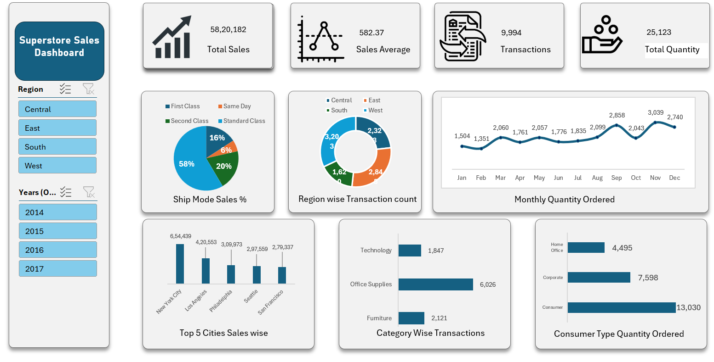

# Superstore Sales Dashboard (Excel)

## 📊 Project Overview
This project is an interactive Excel dashboard built to analyze Superstore sales data and derive key business insights.

## 🚀 Key Features
- KPI Cards (Total Sales, Average Sales, Transactions, Quantity)
- Region and Year slicers for dynamic filtering
- Monthly sales trend analysis
- Category-wise and customer segment insights
- Top cities sales analysis

## 🛠 Tools Used
- Microsoft Excel
- Pivot Tables
- Charts
- Slicers

## 📷 Dashboard Preview

## 🎯 Purpose
To demonstrate data analysis, visualization, and dashboard-building skills using Excel.

## 📌 Learnings
- Data cleaning and transformation
- Building interactive dashboards
- Using slicers for dynamic filtering
- Visual storytelling with data
